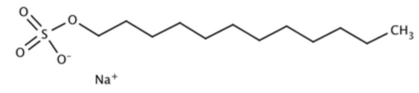
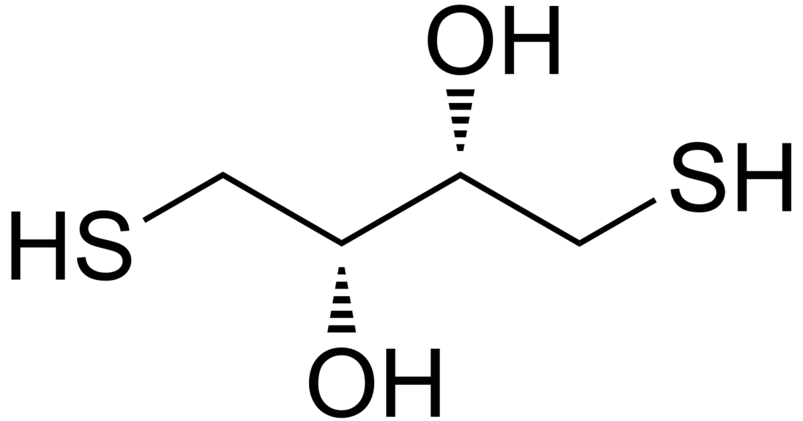

```{r setup, include=FALSE}
knitr::opts_chunk$set(echo=FALSE, message=FALSE, warning=FALSE)
```
# (B) Calibration curve
```{r}
# import library for read_excel
library(readxl)
# import excel file "data.xlsx" into R
data <- read_excel("Book.xlsx")
# sheet "B" as b dataframe with column names
b <- read_excel("Book.xlsx", sheet = "B", col_names = TRUE)

# create concentration with 3 ml final solution from the b$volume vector
b$conc <- b$vol / 3

print(b)
```
## Curve graph
```{r}
library(ggplot2)
# from b ggplot2 the vol vs abs 
# add labels x: volume in micro litres, y: absorbance in %
ggplot(b, aes(x = conc, y = abs)) + geom_point() + geom_smooth(method = "lm") + labs(x = "Concentration", y = "Absorbance (%)") + ggtitle("Calibration curve")

#generate linear model of the line vol and abs
model_b <- lm(abs ~ conc, data = b)

# print the gradient and the intercept with the r value
print(paste("The linear model is:", model_b[[1]][[1]], "x +", model_b[[1]][[2]], "with $r^2$ =", summary(model_b)$r.squared))
```


## Questions

1. Yes, it is linear, with a high R-squared value.

# (C) Lysozyme activity assay
```{r}

# sheet "C" as c dataframe with column names
c <- read_excel("Book.xlsx", sheet = "C", col_names = TRUE)
# set 75 be be average of column 75_1 and 75_2, repeat for 50, 30, 15
c$avg_75 <- (c$`75_1` + c$`75_2`) / 2
c$avg_50 <- (c$`50_1` + c$`50_2`) / 2
c$avg_30 <- (c$`30_1` + c$`30_2`) / 2
c$avg_15 <- (c$`15_1` + c$`15_2`) / 2

# generate a table with the average of each concentration vs c$time
c_table <- data.frame(c$time, c$avg_75, c$avg_50, c$avg_30, c$avg_15)
colnames(c_table) <- c("time", "75", "50", "30", "15")
print(c_table)
```

## Inital rates of reactions, reaction graphs

For our reaction graphs, these were meant to have a level of logathrimic decay, however due to the lack of time, we were unable to complete this, and thus have done a linear fit for the initial rate of reaction.

```{r}
# generate an exponential model for each of the averages vs time for the first 30 seconds of the reaction
model_c_75 <- lm(avg_75 ~ time, data = c[c$time <= 30, ])
model_c_50 <- lm(avg_50 ~ time, data = c[c$time <= 30, ])
model_c_30 <- lm(avg_30 ~ time, data = c[c$time <= 30, ])
model_c_15 <- lm(avg_15 ~ time, data = c[c$time <= 30, ])

# plot a graph from dataset c for avg_75 vs time with model of model_c_75
ggplot(c, aes(x = time, y = avg_75)) + geom_point() + geom_smooth(method = "lm", formula = y ~ x) + labs(x = "Time (s)", y = "Absorbance (%)") + ggtitle("75 micro litres")
#print the equation for the initial rate from the model
print(paste("Initial rate of reaction (first 30 sec): ", round(model_c_75$coefficients[2], 3), "micro litres per second", "with $r^2$ =", summary(model_c_75)$r.squared))

# plot a graph from dataset c for avg_50 with initial rate of reaction starting from 0
ggplot(c, aes(x = time, y = avg_50)) + geom_point() + geom_smooth(method = "lm", formula = y ~ x) + labs(x = "Time (s)", y = "Absorbance (%)") + ggtitle("50 micro litres")
#print the equation for the initial rate from the model
print(paste("Initial rate of reaction (first 30 sec): ", round(model_c_50$coefficients[2], 3), "micro litres per second", "with $r^2$ =", summary(model_c_50)$r.squared))

# plot a graph from dataset c for avg_30 with initial rate of reaction starting from 0
ggplot(c, aes(x = time, y = avg_30)) + geom_point() + geom_smooth(method = "lm", formula = y ~ x) + labs(x = "Time (s)", y = "Absorbance (%)") + ggtitle("30 micro litres")
#print the equation for the initial rate from the model
print(paste("Initial rate of reaction (first 30 sec): ", round(model_c_30$coefficients[2], 3), "micro litres per second", "with $r^2$ =", summary(model_c_30)$r.squared))

# plot a graph from dataset c for avg_15 with initial rate of reaction starting from 0
ggplot(c, aes(x = time, y = avg_15)) + geom_point() + geom_smooth(method = "lm", formula = y ~ x) + labs(x = "Time (s)", y = "Absorbance (%)") + ggtitle("15 micro litres")
#print the equation for the initial rate from the model
print(paste("Initial rate of reaction (first 30 sec): ", round(model_c_15$coefficients[2], 3), "micro litres per second", "with $r^2$ =", summary(model_c_15)$r.squared))
```

## Rate graph

```{r}
# generate a table with the initial rate of reaction for each volume without rounding
c_rate_table <- data.frame(c(75, 50, 30, 15), c(model_c_75$coefficients[2], model_c_50$coefficients[2], model_c_30$coefficients[2], model_c_15$coefficients[2]))
colnames(c_rate_table) <- c("volume", "rate")
# make rates positive
c_rate_table$rate <- abs(c_rate_table$rate)
print(c_rate_table)

# plot a graph from dataset c for avg_15 with initial rate of reaction starting from 0
ggplot(c_rate_table, aes(x = volume, y = rate)) + geom_point() + geom_smooth(method = "lm", formula = y ~ x) + labs(x = "Volume (micro litres)", y = "Rate (micro litres per second)") + ggtitle("Rate of reaction")
```

## Questions

1. The decrease in OD600 is linear with time, despite expecting a curve that eventually plateaus. Possible reasons for this are that not enough time was allowed for the rate of reaction to plateau and that the solution is at a non-ideal temperature, so there is another limiting factor limiting the rate of reaction other than the substrate.

2. It is linear, despite expecting a curve that plateaus at higher concentrations. This may be because there were not enough data points, and hence are only looking at the linear part of the curve.

# (D) The effect of pH on activity

```{r}

# sheet "D" as d dataframe with column names
d <- read_excel("Book.xlsx", sheet = "D", col_names = TRUE)
d$avg_8 <- (d$`8_1` + d$`8_2`) / 2
d$avg_72 <- (d$`7.2_1` + d$`7.2_2`) / 2
d$avg_58 <- (d$`5.8_1` + d$`5.8_2`) / 2


# generate a table with the average of each concentration vs c$time
d_table <- data.frame(d$time, d$avg_8, d$avg_72, d$avg_58)
colnames(d_table) <- c("time", "8", "7.2", "5.8")
print(d_table)
```

## Graph of rate against pH

We also included the 50 micro litre reaction in this graph, as it was the same volume of reactants but a pH of 6.4.

```{r}
# generate an exponential model for each of the averages vs time 
model_d_8 <- lm(avg_8 ~ time, data = d)
model_d_72 <- lm(avg_72 ~ time, data = d)
model_d_58 <- lm(avg_58 ~ time, data = d)
# include the 50 value from set c
model_d_64 <- lm(avg_50 ~ time, data = c)

#  generate a table with the initial rate of reaction for each volume
d_rate_table <- data.frame(c(8, 7.2, 5.8, 6.4), c(model_d_8$coefficients[2], model_d_72$coefficients[2], model_d_58$coefficients[2], model_d_64$coefficients[2]))
colnames(d_rate_table) <- c("pH", "rate")
# make rates positive
d_rate_table$rate <- abs(d_rate_table$rate)
print(d_rate_table)

# plot a graph from dataset d for avg_8 vs time with model of model_d_8
ggplot(d, aes(x = time, y = avg_8)) + geom_point() + geom_smooth(method = "lm", formula = y ~ x) + labs(x = "Time (s)", y = "Absorbance (%)") + ggtitle("pH 8")
```

## Questions

1. That the lyzosyme enzyme works best at an acidic pH (of the pHs studied, the one which had the highest enzyme activity was 5.8).

2. It does, as the amino acids glutamine and asparagine that are involved in the catalysis of peptidoglycan require the pH to be slightly acidic so that glutamine is protonated.

# (E) The effect of temperature on activity

*Please note this data was collected from other students however the analysis is our own*

```{r}
# sheet "E" as e dataframe with column names
e <- read_excel("Book.xlsx", sheet = "E", col_names = TRUE)
# temperature in degrees celsius form 50 to 90 
e$avg_50 <- (e$`50_1` + e$`50_2`) / 2
e$avg_60 <- (e$`60_1` + e$`60_2`) / 2
e$avg_70 <- (e$`70_1` + e$`70_2`) / 2
e$avg_80 <- (e$`80_1` + e$`80_2`) / 2
e$avg_90 <- (e$`90_1` + e$`90_2`) / 2

# generate a table with the average of each concentration vs c$time
e_table <- data.frame(e$time, e$avg_50, e$avg_60, e$avg_70, e$avg_80, e$avg_90)
colnames(e_table) <- c("time", "50", "60", "70", "80", "90")
print(e_table)
```

## Graph of rate against temperature

```{r}
# generate an exponential model for each of the averages vs time
model_e_50 <- lm(avg_50 ~ time, data = e)
model_e_60 <- lm(avg_60 ~ time, data = e)
model_e_70 <- lm(avg_70 ~ time, data = e)
model_e_80 <- lm(avg_80 ~ time, data = e)
model_e_90 <- lm(avg_90 ~ time, data = e)

#  generate a table with the initial rate of reaction for each volume
e_rate_table <- data.frame(c(50, 60, 70, 80, 90), c(model_e_50$coefficients[2], model_e_60$coefficients[2], model_e_70$coefficients[2], model_e_80$coefficients[2], model_e_90$coefficients[2]))
colnames(e_rate_table) <- c("temperature", "rate")
# change the rate to be positive
e_rate_table$rate <- abs(e_rate_table$rate)
print(e_rate_table)

# plot a graph from rate_table with the temperature on the x axis and the initial rate of reaction on the y axis
# do a geom_smooth for the 50, 60 and 70 degrees celsius datapoints and a different geom_smooth for the 80 and 90 deg C
ggplot(e_rate_table, aes(x = temperature, y = rate)) + geom_point() + labs(x = "Temperature (degrees celsius)", y = "Initial rate of reaction (micro litres per second)") + ggtitle("Initial rate of reaction vs temperature") + geom_smooth(method = "lm", formula = y ~ x, data = e_rate_table[1:3,]) + geom_smooth(method = "lm", formula = y ~ x, data = e_rate_table[4:5,])
# print the equation for the 50, 60 and 70 degrees celsius datapoints and the r squared value
e_initial_rate_50_70 <- lm(rate ~ temperature, data = e_rate_table[1:3,])
print(e_initial_rate_50_70)
print(summary(e_initial_rate_50_70).r_squared)
```

## Questions

# (F) The search for lysozymes

```{r}
# sheet "F" as f dataframe with column names
f <- read_excel("Book.xlsx", sheet = "F", col_names = TRUE)
# generate a table with the average of 1 and 2 vs c$time, where 1 is the first dataset and 2 is the second dataset
f_table <- data.frame(f$time, f$`1`, f$`2`)
colnames(f_table) <- c("time", "1", "2")
print(f_table)
```

## Graph of rate against time

```{r}
# f_avg is the average of the two datasets
f$avg <- (f$`1` + f$`2`) / 2
# generate an exponential model for the average vs time
model_f <- lm(avg ~ time, data = f)

#  generate a table with the initial rate of reaction for each volume
f_rate_table <- data.frame(c("1", "2"), c(model_f$coefficients[2], 3, model_f$coefficients[2], 3))
colnames(f_rate_table) <- c("lysozyme", "rate")
# change the rate to be positive
f_rate_table$rate <- abs(f_rate_table$rate)
print(f_rate_table)

# plot a graph from dataset f for avg vs time with model of model_f and model for 0, 10 and 20 seconds
ggplot(f, aes(x = time, y = avg)) + geom_point() + geom_smooth(method = "lm", formula = y ~ x) + labs(x = "Time (s)", y = "Absorbance (%)") + ggtitle("Change in absorbance over time for saliva Lysozyme") + geom_smooth(method = "lm", formula = y ~ x, data = f[1:3,])

model_f_13 <- lm(avg ~ time, data = f[1:3,])
#print the linear model for 1:3 and the r squared value
print(paste("y = ", model_f_13$coefficients[2], "x + ", model_f_13$coefficients[1]))
```

## Questions

# (G) The effect of denaturing the lysozymes on activity

*Please note this data was collected from other students however the analysis is our own*
```{r}
# sheet "G" as g dataframe with column names
g <- read_excel("Book.xlsx", sheet = "G", col_names = TRUE)
```

| Enzyme treatment | Observation when added to bacteria |
|------------------|------------------------------------|
| `r g$"Treatment"[1]` | `r g$"Change"[1]` |
| `r g$"Treatment"[2]` | `r g$"Change"[2]` |
| `r g$"Treatment"[3]` | `r g$"Change"[3]` |
| `r g$"Treatment"[4]` | `r g$"Change"[4]` |
| `r g$"Treatment"[5]` | `r g$"Change"[5]` |
| `r g$"Treatment"[6]` | `r g$"Change"[6]` |
| `r g$"Treatment"[7]` | `r g$"Change"[7]` |

## Questions

1. It does, as the amino acids glutamine and asparagine that are involved in the catalysis of peptidoglycan require the pH to be slightly acidic so that glutamine is protonated.

2. Because when the protein is heated it forms new hydrogen and van der waal bonds without order, which remain when the enzyme is cooled down, so it forms a different tertiary structure, so the active site is no longer complementary to the peptidoglycan, so cannot catalyse the reaction.

3. SDS is an organic sodium salt that is the sodium salt of dodecyl hydrogen sulfate. It has a role as a detergent and a protein denaturant.
Image of SDS: 
```{r, out.width = "400px"}

```

4. Dithiothreitol is the threo-diastereomer of 1,4-dimercaptobutane-2,3-diol. It has a role as a reducing agent.
Image of DTT: 
```{r, out.width = "400px"}

```

