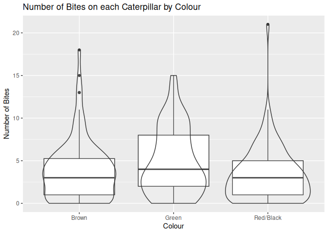
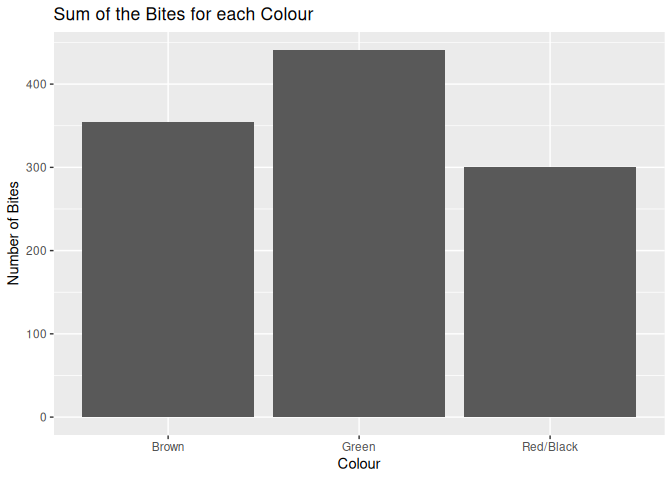
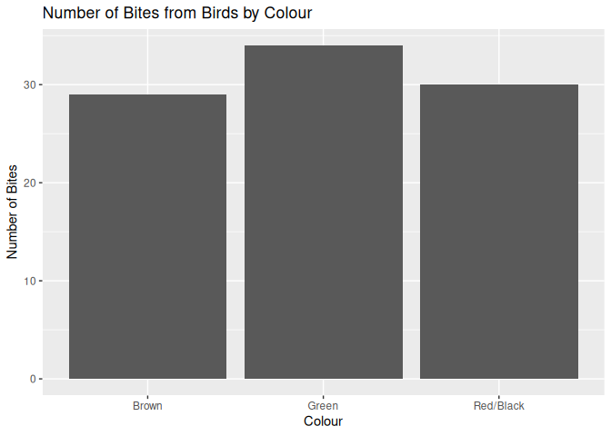
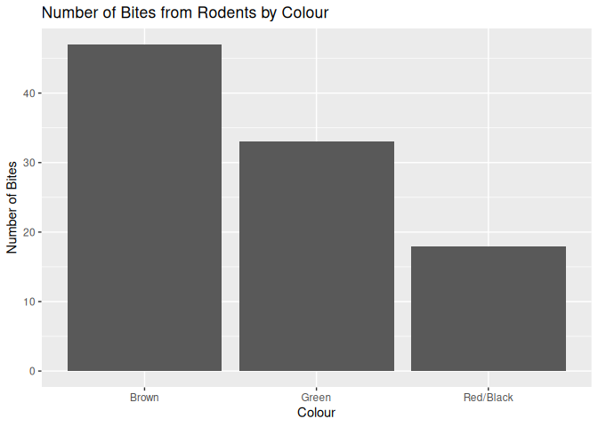
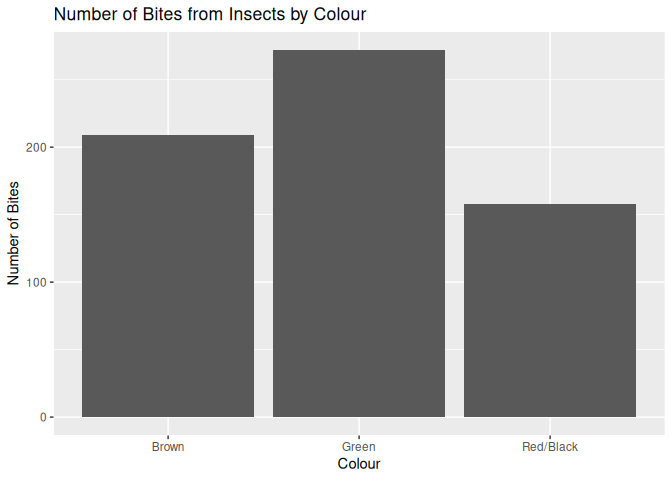
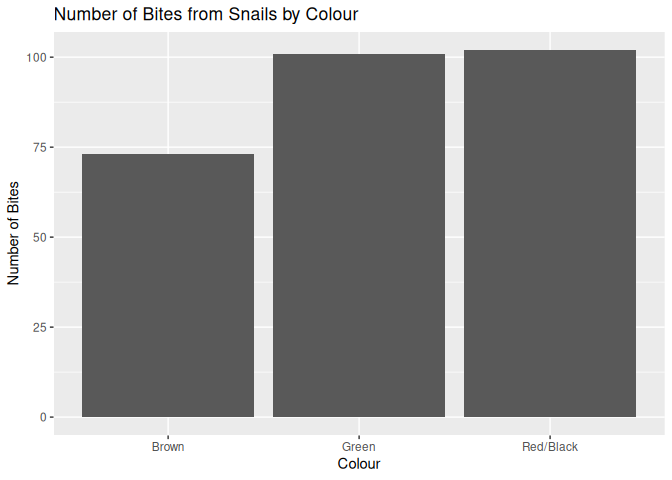

-   [1 Introduction](#introduction)
-   [2 Methods](#methods)
    -   [2.1 Creating and setting
        caterpillars](#creating-and-setting-caterpillars)
    -   [2.2 Analysing caterpillars](#analysing-caterpillars)
    -   [2.3 Results data analysis](#results-data-analysis)
-   [3 Results](#results)
    -   [3.1 General averages](#general-averages)
    -   [3.2 Significance of colour for number
        bites](#significance-of-colour-for-number-bites)
    -   [3.3 Significance in colour on type of
        bites](#significance-in-colour-on-type-of-bites)
        -   [3.3.1 Birds](#birds)
        -   [3.3.2 Rodents](#rodents)
        -   [3.3.3 Insects](#insects)
        -   [3.3.4 Snails](#snails)
-   [4 Discussion](#discussion)
    -   [4.1 Results discussion](#results-discussion)
    -   [4.2 Considerations of accuracy](#considerations-of-accuracy)
    -   [4.3 Suggestions for further
        study](#suggestions-for-further-study)
-   [5 References](#references)

The code and dataset for this write up can be found at:
<https://github.com/th-holland/Mini-Research-Projects/tree/main/Evolution%20Practicals/1%20-%20Catapillar>

<figure>
<figcaption aria-hidden="true">QR code</figcaption>
</figure>

# 1 Introduction

The aim of this experiment is to evaluate the adaptive advantages that
the colours and patterning have on the survival rates of caterpillars.
For this experiment, we limited our colour styles to an aposematic red
and black striped colour patterning; a solid green colour that acts as a
non-aposematic nor camouflaged caterpillar; and a solid brown colour to
act as a camouflaged caterpillar.

These colour patterns were left at set heights on trees of similar
dimensions for a period of 36 hours. The caterpillars were then
collected and any marks found were categories based on likely predator
source (birds, insects, mammalian or snails) and then quantitatively
scored on levels of damage.

We also recorded several other variables that we thought may have had an
affect on the attack rate on the caterpillars. These co-variables
included the geographical location (through the College location), the
tree species and size (diameter), height at which the caterpillars were
set, and the habitat type.

The analysed results showed significant variation in the number of bite
marks between the different colour patterns (ANOVA *p*-value of 0.0116),
with the red and black striped caterpillars having the lowest number of
bite marks, and the green caterpillars having the highest number of bite
marks, with a high significance of the difference (Chi Squared test
*p*-value of 0.007). There was no significance within the bird and snail
categories in respect to the number of bite marks in each colour
pattern, but there was a significant difference between the colours
within the insect and rodent categories (ANOVA *p*-value of 0.0042 and
0.0582 respectively).

# 2 Methods

## 2.1 Creating and setting caterpillars

We followed a standardised procedure to create the caterpillars that
resulted in consistent sizes, patterning and shapes. All three
colourways were created by cutting lengths of plasticine into 5 mm
lengths, and rejoining in the correct pattering. This consistency across
all colourways ensured that the caterpillars not only were all of the
similar dimension but also it reduced the likelihood of any bias in the
results due different manhandling of the caterpillars.

We individually selected suitable trees based on preset criteria,
specifically as diameter and distance from closest pathway. We set the a
set of black and red; brown; and green caterpillars at 30cm above the
ground at 15cm horizontal spacing, and repeated this placement at 45 cm
and 60 cm above the ground. This ensured that the caterpillars were set
at a range of heights and that the caterpillars were not set too close
to each other.

At this point we also recorded the tree species, diameter, and habitat
type. We also recorded the geographical location of the tree using the
College’s location.

## 2.2 Analysing caterpillars

We collected the caterpillars after 36 hours and recorded the number of
marks on each caterpillar. We then categorised the marks based on likely
predator source (birds, insects, mammalian or snails) and then
quantitatively scored on levels of damage. We also recorded if any of
the caterpillars were moved from their original position and if any were
missing.

We utilised the schematics for predation sources from Low et al. (2014)
to help us categorise each mark. We scaled the damage based on number of
discrete bite marks for birds, mammals or insects, and the proportionate
surface area coverage for snails on a scale of 1-10.

The results were then collated for analysis in a dataset that recorded
each of the variables mentioned above.

## 2.3 Results data analysis

The data was initially cleaned to remove any entries with missing values
and to remove any caterpillars that were missing. The dataset can be
viewed in the research repository listed at the top of this report.

Following on from the method above, initial analysis included general
means and standard deviations across the population as well as based on
the damage categories.

Further analysis was then completed to compare the damage levels between
the different colourways to assess if there was any significant
difference between the colourways.

Out of further interest, analysis was done based on the height of
caterpillars compared to the source of damage to see if there was any
significant linkage between these values.

# 3 Results

## 3.1 General averages

The averages for the total number of bites per caterpillar are shown in
the table below with the standard deviation for each colourway.

<table>
<thead>
<tr class="header">
<th>Colour</th>
<th>Average</th>
<th>Standard Deviation</th>
</tr>
</thead>
<tbody>
<tr class="odd">
<td>Brown</td>
<td>3.8586957</td>
<td>3.5721189</td>
</tr>
<tr class="even">
<td>Green</td>
<td>4.8461538</td>
<td>3.8784965</td>
</tr>
<tr class="odd">
<td>Red Black</td>
<td>3.2717391</td>
<td>3.2517223</td>
</tr>
</tbody>
</table>

This is shown in the box plot below, with outliers shown as black points
and other points shown as as transparent points:

## 3.2 Significance of colour for number bites

I tested these values to see if there is any significant variation from
the null hypothesis that the average number of bites is the same for all
three colourways. I used the one-way ANOVA test to test this hypothesis
because there is three categories from the same categorical group on the
independent variable and a continuos dependent variable. The results of
this test are shown below:

    ##                      Df Sum Sq Mean Sq F value Pr(>F)  
    ## data$Colour..B.RB.G   2    116   57.88   4.527 0.0116 *
    ## Residuals           272   3477   12.78                 
    ## ---
    ## Signif. codes:  0 '***' 0.001 '**' 0.01 '*' 0.05 '.' 0.1 ' ' 1

The *p*-value from the test: 0.0116375.

The KW test was also run:

    ##   Kruskal-Wallis rank sum test
    ## 
    ## data: x and group
    ## Kruskal-Wallis chi-squared = 8.0867, df = 2, p-value = 0.02
    ## 
    ## 
    ##                            Comparison of x by group                            
    ##                                  (Bonferroni)                                  
    ## Col Mean-|
    ## Row Mean |          B          G
    ## ---------+----------------------
    ##        G |  -1.707939
    ##          |     0.1315
    ##          |
    ##       RB |   1.119220   2.824098
    ##          |     0.3946    0.0071*
    ## 
    ## alpha = 0.05
    ## Reject Ho if p <= alpha/2

    ## $chi2
    ## [1] 8.086663
    ## 
    ## $Z
    ## [1] -1.707940  1.119221  2.824098
    ## 
    ## $P
    ## [1] 0.043823765 0.131523001 0.002370693
    ## 
    ## $P.adjusted
    ## [1] 0.131471295 0.394569003 0.007112078
    ## 
    ## $comparisons
    ## [1] "B - G"  "B - RB" "G - RB"

## 3.3 Significance in colour on type of bites

To find the significance of the colour based on the bite marks, a box
plot was created for each colourway with the bite marks grouped by the
type of bite. This was done to illustrate any significant difference
between the colourways based on the type of bite.

To test the significance of this data a ANOVA test was used to test the
null hypothesis that the number of bites is the same for all three
colourways within each bite type.

The KW test was run to test the null hypothesis that the number of bites
from birds is the same for all three colourways.

### 3.3.1 Birds

    ##                      Df Sum Sq Mean Sq F value Pr(>F)
    ## data$Colour..B.RB.G   2   0.18  0.0882    0.18  0.836
    ## Residuals           272 133.37  0.4903

    ##   Kruskal-Wallis rank sum test
    ## 
    ## data: x and group
    ## Kruskal-Wallis chi-squared = 0.7539, df = 2, p-value = 0.69
    ## 
    ## 
    ##                            Comparison of x by group                            
    ##                                  (Bonferroni)                                  
    ## Col Mean-|
    ## Row Mean |          B          G
    ## ---------+----------------------
    ##        G |  -0.724552
    ##          |     0.7031
    ##          |
    ##       RB |   0.053458   0.777864
    ##          |     1.0000     0.6550
    ## 
    ## alpha = 0.05
    ## Reject Ho if p <= alpha/2
    ## $chi2
    ## [1] 0.7539087
    ## 
    ## $Z
    ## [1] -0.72455263  0.05345805  0.77786442
    ## 
    ## $P
    ## [1] 0.2343633 0.4786835 0.2183245
    ## 
    ## $P.adjusted
    ## [1] 0.7030898 1.0000000 0.6549734
    ## 
    ## $comparisons
    ## [1] "B - G"  "B - RB" "G - RB"

### 3.3.2 Rodents

    ##                      Df Sum Sq Mean Sq F value Pr(>F)  
    ## data$Colour..B.RB.G   2   4.58   2.288   2.875 0.0582 .
    ## Residuals           272 216.50   0.796                 
    ## ---
    ## Signif. codes:  0 '***' 0.001 '**' 0.01 '*' 0.05 '.' 0.1 ' ' 1

    ##   Kruskal-Wallis rank sum test
    ## 
    ## data: x and group
    ## Kruskal-Wallis chi-squared = 3.4258, df = 2, p-value = 0.18
    ## 
    ## 
    ##                            Comparison of x by group                            
    ##                                  (Bonferroni)                                  
    ## Col Mean-|
    ## Row Mean |          B          G
    ## ---------+----------------------
    ##        G |   0.359979
    ##          |     1.0000
    ##          |
    ##       RB |   1.753245   1.388470
    ##          |     0.1193     0.2475
    ## 
    ## alpha = 0.05
    ## Reject Ho if p <= alpha/2
    ## $chi2
    ## [1] 3.425828
    ## 
    ## $Z
    ## [1] 0.359979 1.753246 1.388470
    ## 
    ## $P
    ## [1] 0.35943142 0.03977990 0.08249698
    ## 
    ## $P.adjusted
    ## [1] 1.0000000 0.1193397 0.2474909
    ## 
    ## $comparisons
    ## [1] "B - G"  "B - RB" "G - RB"

### 3.3.3 Insects

    ##                      Df Sum Sq Mean Sq F value  Pr(>F)   
    ## data$Colour..B.RB.G   2   74.3   37.17   5.575 0.00424 **
    ## Residuals           272 1813.8    6.67                   
    ## ---
    ## Signif. codes:  0 '***' 0.001 '**' 0.01 '*' 0.05 '.' 0.1 ' ' 1

    ##   Kruskal-Wallis rank sum test
    ## 
    ## data: x and group
    ## Kruskal-Wallis chi-squared = 12.9807, df = 2, p-value = 0
    ## 
    ## 
    ##                            Comparison of x by group                            
    ##                                  (Bonferroni)                                  
    ## Col Mean-|
    ## Row Mean |          B          G
    ## ---------+----------------------
    ##        G |  -2.121360
    ##          |     0.0508
    ##          |
    ##       RB |   1.466500   3.583848
    ##          |     0.2138    0.0005*
    ## 
    ## alpha = 0.05
    ## Reject Ho if p <= alpha/2
    ## $chi2
    ## [1] 12.9807
    ## 
    ## $Z
    ## [1] -2.121360  1.466501  3.583849
    ## 
    ## $P
    ## [1] 0.0169457587 0.0712559422 0.0001692842
    ## 
    ## $P.adjusted
    ## [1] 0.0508372760 0.2137678266 0.0005078526
    ## 
    ## $comparisons
    ## [1] "B - G"  "B - RB" "G - RB"

### 3.3.4 Snails

    ##                      Df Sum Sq Mean Sq F value Pr(>F)
    ## data$Colour..B.RB.G   2    6.1   3.053   0.608  0.545
    ## Residuals           272 1366.9   5.025

    ##   Kruskal-Wallis rank sum test
    ## 
    ## data: x and group
    ## Kruskal-Wallis chi-squared = 1.7837, df = 2, p-value = 0.41
    ## 
    ## 
    ##                            Comparison of x by group                            
    ##                                  (Bonferroni)                                  
    ## Col Mean-|
    ## Row Mean |          B          G
    ## ---------+----------------------
    ##        G |  -0.281993
    ##          |     1.0000
    ##          |
    ##       RB |  -1.272202  -0.986727
    ##          |     0.3050     0.4857
    ## 
    ## alpha = 0.05
    ## Reject Ho if p <= alpha/2
    ## $chi2
    ## [1] 1.783747
    ## 
    ## $Z
    ## [1] -0.2819934 -1.2722020 -0.9867279
    ## 
    ## $P
    ## [1] 0.3889743 0.1016507 0.1618880
    ## 
    ## $P.adjusted
    ## [1] 1.0000000 0.3049520 0.4856641
    ## 
    ## $comparisons
    ## [1] "B - G"  "B - RB" "G - RB"

# 4 Discussion

## 4.1 Results discussion

The ANOVA test for the difference in number of bites between the
colourways returned with a *p*-value of 0.0116, which is much smaller
than the normal biological *p*-value used. This means that the dataset
we collected suggests that there is reason to reject the null hypothesis
that the colour does not affect the number of bites. This means that the
colour of the caterpillars does affect the number of bites. This is
supported by the box plots of the data, which show that the number of
bites is significantly different between the colourways. The box plot
also supports the results from the Chi Square test that suggests that
there is high significance (*p* = 0.007) in the difference between the
number of bites in the green and the red-black as well as some
significance (*p* = 0.13) in the difference between the number of bites
in the green and the brown caterpillars. There is also a small
significance (*p* = 0.394) in the difference between the number of bites
in the red-black caterpillars and the brown caterpillars, however there
is over a 60% probability that these results were due to random chance
and not a correlation.

The colour differences in the caterpillars could have affected the
number of bites for several reasons. For example, with birds it has been
suggested by Hernandez-Aguero et al. (2020) that colours can either act
to camouflage the caterpillar, such as the brown caterpillar on the
brown tree barks, or signal to the predator that the prey may be
unpalatable, through aposematic linkage. However, this is not consistent
with the data collected, as there was no significant difference between
the number of bird bites between the colour groups (*p*-values of 0.84
and 0.69 for the ANOVA and KW test respectively). This could be because
the birds were not able to see the colour of the caterpillar, or because
the colour of the caterpillar did not affect the birds’ decision to
bite.

The only significant value that occurred within the rodent data was with
the difference between the number of bites in the red-black and the
brown caterpillars (*p*-value of 0.11). This could be because the brown
caterpillars were more palatable to the rodents, as they were more
similar in colour to the tree bark or to their normal food. This is
supported by the fact that the brown caterpillars had the highest number
of bites from rodents.

There was a high significance in the ANOVA test for the insect bites
(*p*-value of 0.0042), which suggests that the colour of the caterpillar
does affect the number of bites from insects. This is supported by the
KW test, which also suggests that there is a high significance in the
difference between the number of bites in the green and the red-black
caterpillars (*p*-value of 0.000508). This varies from other sources
such as Seifert et al. (2015), however these were collected in different
climates with different indigenous insects. This could mean that the
insects in the UK are more attracted to the green caterpillars, or that
the green caterpillars are more palatable to the insects for other
reasons.

There was no significance within the snail data, with *p*-values around
0.5 for both the ANOVA and KW tests. This could be because the snails
were not able to see the colour of the caterpillars, or because the
snails find food via other means, such as by olfactory cues as was
suggested by Teyke (1995).

## 4.2 Considerations of accuracy

There were several points within this experiment that could have
affected the accuracy of the data collected.

Firstly, the data collection, although it was done through a controlled
procedure, was still done by different people across the dataset with
differing knowledges and subjective interpretations on marks on the
models. This could have affected the accuracy of the data collected, as
some people may have been more lenient on what they considered a bite or
mark, or may have been more strict.

Secondly, although the caterpillars were made via the same procedure,
the procedure is limited by the fact that the caterpillars were not able
to be made in a controlled environment. This means that the caterpillars
were not able to be made in the same conditions, and could have affected
the accuracy of the data collected. An example of this is the oils on
the hands of the person making the caterpillars, which could have
affected the palatability of the caterpillars to the predators.

Thirdly, all the caterpillars displayed the same “behaviours”
(i.e. stationary on the side of the tree) which may not be consistent
with the varied behaviours utilised by different colours of
caterpillars. This could have affected the accuracy of the experiment as
either the predators may have been more attracted as there was a more
obvious target, or the predators may have been less attracted as the
caterpillars were not moving.

Also, an important point to note is that the missing caterpillars were
discarded as we were unable to determine what was the cause for the
disappearance, however, assuming that the caterpillars were eaten by the
predators, this could have affected the accuracy of the data collected.
This is because the caterpillars that were eaten by the predators would
not have been recorded as a bite, and therefore would not have been
included in the data collected. This could have affected the accuracy of
the data collected as it would have been a bias towards the caterpillars
that were not eaten by the predators via survivorship bias.

Another important note is that the data collectors were under
supervision by the experiment leaders, however, the experiment leaders
were not present during the data collection. This could have affected
the accuracy of the data collected as there could have been mistakes
made by the data collectors, accidental or otherwise, which could affect
the validity of the results collected.

## 4.3 Suggestions for further study

Further areas of interest that could be studied from similar procedures:

-   The effects of varying the concentration of the caterpillars on the
    number of bites.
-   The effects of the height of the caterpillars on the number of
    bites.
-   The effects of the size of the caterpillars on the number of bites.
-   Seasonal affects on the number of bites.

To improve the accuracy of the data recorded, it would be beneficial to
have motion video traps set up to record the predators’ behaviours, as
this would allow for more accurate data collection. This would also
allow for more accurate data collection of the predators’ behaviours,
such as the time taken to bite the caterpillar, the number of bites per
predator, and the number of predators per caterpillar. This would also
allow for more accurate data collection of the missing caterpillars, as
the video footage would allow for the predators’ behaviours to be
recorded, and therefore the missing caterpillars could be determined to
have been eaten by the predators or not.

# 5 References

Hernandez-Aguero, J. A., V. Polo, M. Garcia, D. Simon, I. Ruiz-Tapiador,
and L. Cayuela. 2020. “Effects of Prey Colour on Bird Predation: An
Experiment in Mediterranean Woodlands.” *Animal Behaviour* 170
(December): 89–97. <https://doi.org/10.1016/j.anbehav.2020.10.017>.

Low, Petah A., Katerina Sam, Clare McArthur, Mary Rose C. Posa, and
Dieter F. Hochuli. 2014. “Determining Predator Identity from Attack
Marks Left in Model Caterpillars: Guidelines for Best Practice.”
*Entomologia Experimentalis Et Applicata* 152 (2): 120–26.
<https://doi.org/10.1111/eea.12207>.

Seifert, Carlo Lutz, Lisamarie Lehner, Marc-Oliver Adams, and Konrad
Fiedler. 2015. “Predation on Artificial Caterpillars Is Higher in
Countryside Than Near-Natural Forest Habitat in Lowland South-Western
Costa Rica.” *Journal of Tropical Ecology* 31 (3): 281–84.
<https://doi.org/10.1017/S0266467415000012>.

Teyke, T. 1995. “Food-Attraction Conditioning in the Snail, Helix
Pomatia.” *Journal of Comparative Physiology A* 177 (4): 409–14.
<https://doi.org/10.1007/BF00187477>.
